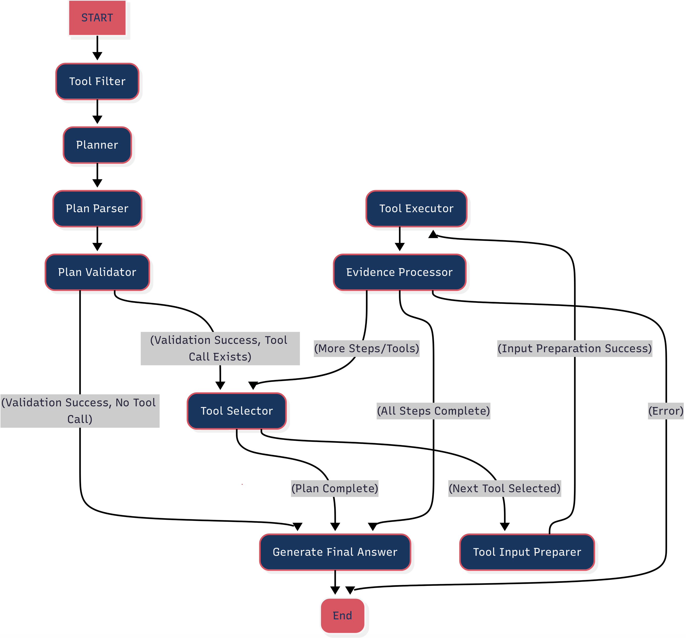

# MCP Agent


## Diagram



## 개요 (Overview)

이 프로젝트는 **ReWOO (Reasoning WithOut Observation)** 패턴을 기반으로 구현된 LangGraph 에이전트입니다. ReAct (Reasoning and Acting) 패턴과 유사하게 추론하고 행동하지만, 관찰(Observation) 단계를 명시적으로 분리하지 않고 계획 단계에서 필요한 증거를 미리 정의함으로써 특히 소형 LLM(Small LLM) 사용 시 프롬프트의 양과 복잡성을 줄이는 데 목적을 둡니다.

또한, MCP(Model Context Protocol) 서버와의 효율적인 상호작용을 위해 도구 필터링, 계획 검증 및 수정, 증거 관리 등 여러 최적화 로직을 포함하고 있습니다.

## LangGraph 노드 구성 (Architecture: LangGraph Nodes)

이 에이전트는 다음과 같은 LangGraph 노드들로 구성되어 ReWOO 워크플로우를 실행합니다:

1.  **`tool_filter`**: 에이전트 실행 시작 시, 사용자 쿼리와 사용 가능한 모든 도구 설명을 기반으로 현재 작업에 가장 관련성 높은 도구들만 필터링합니다.
2.  **`planner`**: 필터링된 도구 정보를 바탕으로 사용자 쿼리를 해결하기 위한 단계별 실행 계획(YAML 형식)을 생성합니다. 오류 발생 시 계획 수정 로직도 담당합니다.
3.  **`plan_parser`**: `planner`가 생성한 원시 YAML 계획을 파싱하고 구조적 유효성을 검증합니다. 파싱/검증 오류 시 LLM을 이용한 자동 수정 로직이 포함될 수 있습니다.
4.  **`plan_validator`**: 파싱된 계획 내에 포함된 도구 이름들이 `tool_filter` 단계에서 선택된 유효한 도구 목록에 있는지 최종적으로 검증합니다.
5.  **`tool_selector`**: 검증된 계획에서 현재 실행할 단계의 도구를 선택합니다.
6.  **`tool_input_preparer`**: 선택된 도구의 입력을 준비합니다. 이 과정에서 이전 단계에서 수집된 증거(`evidence`)를 참조하여 플레이스홀더(#E1 등)를 실제 값으로 치환합니다.
7.  **`tool_executor`**: 준비된 입력으로 실제 도구(MCP 서버를 통해)를 실행하고 결과를 받아옵니다.
8.  **`evidence_processor`**: 도구 실행 결과를 처리하고 `evidence` 딕셔너리에 저장합니다. (현재는 플레이스홀더에 가까우며 추가 로직 구현 가능)
9.  **`generate_final_answer`**: 모든 계획 단계가 완료되거나 도구 호출 없이 계획이 종료될 때, 수집된 모든 증거를 종합하여 최종 답변을 생성합니다.

## 프로젝트 구조 (Project Structure)

```
.
├── agent/             # ReWOO 에이전트 핵심 로직
│   ├── graph.py       # LangGraph 그래프 정의
│   ├── state.py       # 에이전트 상태 정의 (ReWOOState)
│   ├── nodes/         # 그래프 노드 구현 (planner, parser, executor 등)
│   ├── prompts/       # LLM 프롬프트 정의
│   └── utils.py       # 유틸리티 함수
├── core/              # 핵심 유틸리티
│   └── llm_loader.py  # LLM 인스턴스 로드 및 관리
├── tests/             # 테스트 코드 (단위/통합)
├── images/            # README용 이미지
├── mcp.json           # MCP 서버 설정 파일
├── main.py            # 에이전트 실행 스크립트
├── .env.example       # 환경 변수 설정 예시
└── README.md          # 프로젝트 설명서
```

## 설정 (Setup)

1.  **저장소 복제:**
    ```bash
    git clone <repository_url>
    cd mcp-agent
    ```

2.  **가상 환경 생성 및 활성화 (권장):**
    ```bash
    python -m venv venv
    source venv/bin/activate  # macOS/Linux
    # venv\Scripts\activate    # Windows
    ```

3.  **필수 라이브러리 설치:**
    ```bash
    pip install -r requirements.txt # (requirements.txt 파일이 있다면)
    # 또는 필요한 라이브러리를 직접 설치:
    pip install langchain langgraph langchain-community langchain-openai langchain-google-genai langchain-anthropic langchain_mcp_adapters python-dotenv httpx openai
    # 로컬 모델 사용 시:
    # pip install llama-cpp-python
    ```

4.  **환경 변수 설정:**
    *   `.env.example` 파일을 복사하여 `.env` 파일을 생성합니다.
    *   `.env` 파일에 사용할 LLM 제공자에 따라 필요한 정보를 입력합니다.

    **API 기반 LLM 사용 시:**

    *   **하나의 API 키**와 **MODEL_NAME**을 설정해야 합니다.
        *   **OpenRouter:**
            ```dotenv
            OPEN_ROUTER_API_KEY="sk-or-..."
            MODEL_NAME="qwen/qwen3-14b:free" # 또는 다른 OpenRouter 모델 ID
            # LLM_PROVIDER="openrouter" # 명시적 지정 (선택 사항)
            ```
        *   **Google Gemini:**
            ```dotenv
            GOOGLE_API_KEY="AIz..."
            MODEL_NAME="gemini-1.5-pro-latest" # 또는 다른 Gemini 모델 ID
            # LLM_PROVIDER="google" # 명시적 지정 (선택 사항)
            ```
        *   **Anthropic Claude:**
            ```dotenv
            ANTHROPIC_API_KEY="sk-ant-..."
            MODEL_NAME="claude-3-5-sonnet-20240620" # 또는 다른 Claude 모델 ID
            # LLM_PROVIDER="anthropic" # 명시적 지정 (선택 사항)
            ```
    *   **중요:** API 키를 사용하는 경우, 반드시 `MODEL_NAME` 환경 변수를 설정해야 합니다. 여러 API 키가 동시에 설정된 경우, `LLM_PROVIDER`를 명시적으로 설정하여 사용할 서비스를 지정해야 합니다.

    **로컬 LlamaCpp 모델 사용 시:**

    *   API 키는 설정하지 마십시오.
    *   모델 파일 경로를 설정합니다.
        ```dotenv
        MODEL_PATH="/path/to/your/model.gguf"
        # LLM_PROVIDER="local" # 명시적 지정 (선택 사항)
        # N_CTX=8192         # 선택적 LlamaCpp 파라미터
        # N_GPU_LAYERS=-1    # 선택적 LlamaCpp 파라미터
        # N_BATCH=512        # 선택적 LlamaCpp 파라미터
        ```

    **기타 환경 변수 (선택 사항):**

    *   `TEMPERATURE`: LLM 온도 (기본값: 0.2)
    *   `MAX_TOKENS`: 최대 생성 토큰 수 (기본값: 8192)
    *   `TOP_P`: Top-P 샘플링 (기본값: 0.95)
    *   `TOP_K`: Top-K 샘플링 (Gemini, Claude, LlamaCpp에서 사용, 기본값: 40)

5.  **MCP 서버 설정:**
    *   `mcp.json` 파일에 에이전트가 사용할 도구 서버의 정보를 설정합니다. 각 서버의 이름, 전송 방식(`transport`), 명령어(`command`), 인수(`args`) 또는 URL(`url`) 등을 지정합니다.
    *   예시:
        ```json
        {
          "servers": {
            "taskmaster-ai": {
              "description": "Manages tasks for software development.",
              "transport": "stdio",
              "command": "node",
              "args": ["/path/to/task-master-ai/dist/mcp-server.js"],
              "enabled": true
            }
            // 다른 서버 설정 추가
          }
        }
        ```

## 실행 방법 (Usage)

1.  **에이전트 실행:**
    ```bash
    python main.py
    ```
    *   `main.py` 스크립트는 `.env` 파일과 `mcp.json` 파일을 로드하여 설정을 적용하고, 지정된 LLM과 MCP 도구를 사용하여 ReWOO 에이전트를 실행합니다. 현재는 코드 내에 하드코딩된 쿼리를 사용합니다.

2.  **그래프 시각화:**
    *   에이전트의 LangGraph 구조를 시각화하여 `graph_visualization.png` 파일로 저장하려면 다음 명령어를 사용합니다.
    ```bash
    python main.py --visualize
    ```
    *   **참고:** 시각화를 위해서는 `pygraphviz` 라이브러리가 필요하며, 시스템에 `graphviz`가 먼저 설치되어 있어야 할 수 있습니다 (`brew install graphviz` 또는 `sudo apt-get install graphviz`).

## 아키텍처 개요 (Architecture)


1.  **main.py:** 에이전트 실행 시작점. LLM 로드, MCP 클라이언트 초기화, 그래프 빌드 및 실행.
2.  **core.llm_loader:** 환경 변수를 기반으로 LLM 인스턴스(OpenRouter, Gemini, Claude, LlamaCpp)를 로드하고 관리.
3.  **langchain_mcp_adapters.client:** `mcp.json` 설정을 사용하여 MCP 서버들과 통신하고 사용 가능한 도구를 로드.
4.  **agent.graph:** LangGraph를 사용하여 ReWOO 워크플로우 정의.
    *   **Nodes:** `tool_filter`, `planner`, `plan_parser`, `plan_validator`, `tool_selector`, `tool_input_preparer`, `tool_executor`, `evidence_processor`, `generate_final_answer`.
    *   **State:** `agent.state.ReWOOState`.
5.  **agent.nodes:** 각 노드의 실제 로직 구현.
6.  **agent.prompts:** LLM 호출에 사용될 프롬프트 템플릿.

## 향후 개선 사항 (Future Improvements)

*   사용자 입력 처리 방식 개선 (하드코딩된 쿼리 대신 인터랙티브 입력 또는 인자 받기).
*   다양한 MCP 도구 서버 연동 테스트 및 예제 추가.
*   상세한 오류 처리 및 로깅 강화.
*   상태 관리 및 증거 처리 로직 고도화.